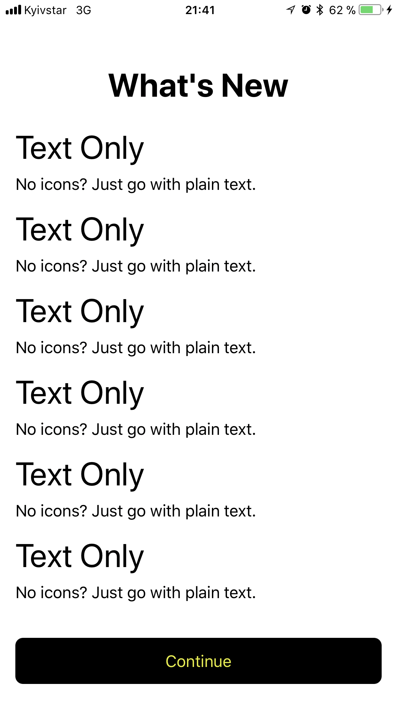

# react-native-whatsnew

<p align="center"></p>

## Description
WhatsNew automatically displays a short description of the new features when users update your app. This is similar to what happens in Apple's apps like Pages, Numbers, Keynote, iMovie and TestFlight.

## Usage
```js
import WhatsNew from 'react-native-whatsnew';

const App = () => {
	const data = [{
		title: 'First title',
		text: 'This is the text for first title'
	}, {
		title: 'Second title',
		text: 'This is the text for second title'
	}];
	
	const onPress = () => {
		// Handle your action for Continue button
	};
	
	<WhatsNew data={data} onPress={onPress} />
}
```

## Author
I'm [Dmytro Batarin](https://batarin.zp.ua). 
Email: [contact@batarin.zp.ua](mailto:contact@batarin.zp.ua).
Inspired by [BalestraPatrick/WhatsNew](https://github.com/BalestraPatrick/WhatsNew)